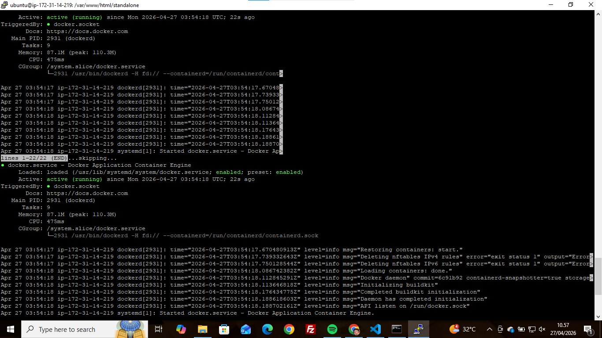
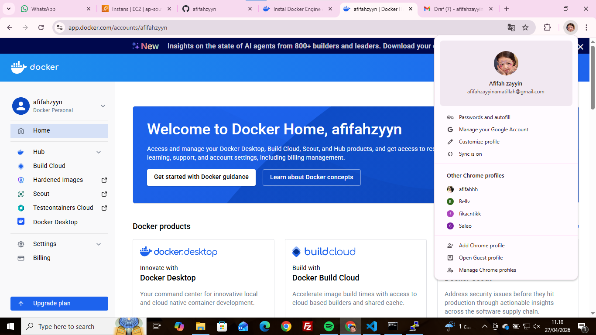
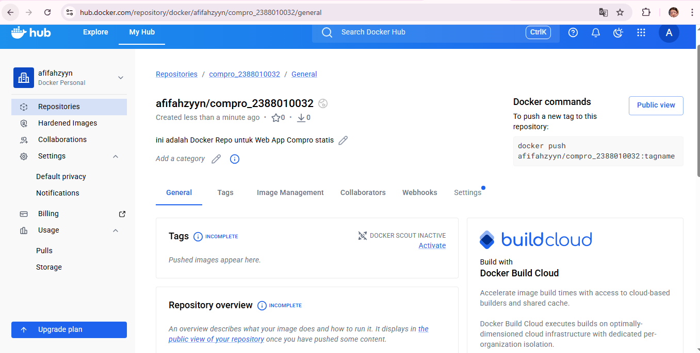
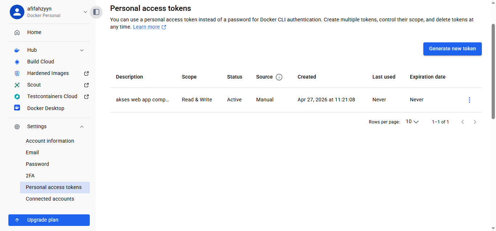
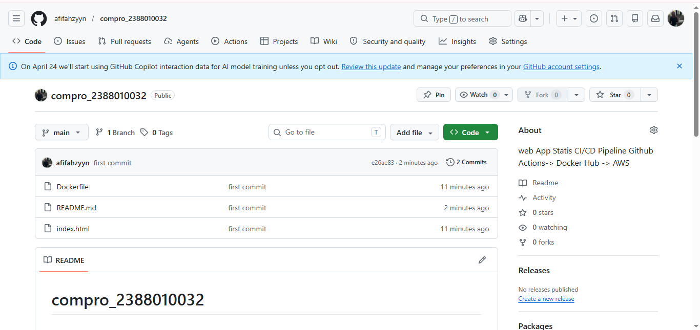

Intro Docker Engine in Instance EC2 AWS

1. Instalasi berdasarkan Dokumentasi Docker ( https://docs.docker.com/engine/install )
    - Hapus instalasi versi lama docker sudo apt remove $(dpkg --get-selections docker.io docker-compose docker-compose-v2 docker-doc podman-docker containerd runc | cut -f1)
    - instal docker
        - sudo apt-get update && sudo apt-get upgrade
        - Tambahkan repositori sertifikat sudo apt install ca-certificates curl sudo install -m 0755 -d /etc/apt/keyrings sudo curl -fsSL https://download.docker.com/linux/ubuntu/gpg -o /etc/apt/keyrings/docker.asc sudo chmod a+r /etc/apt/keyrings/docker.asc
        - Tambahkan repositori Docker ke APT sudo tee /etc/apt/sources.list.d/docker.sources <<EOF Types: deb URIs:
        $(. /etc/os-release && echo "$
          {UBUNTU_CODENAME:-$VERSION_CODENAME}") Komponen: stabil Arsitektur: $(dpkg --print-architecture) Ditandatangani Oleh: /etc/apt/keyrings/docker.asc EOF
        - Perbarui OS sudo apt update
        - Instal docker engine: sudo apt install docker-ce docker-ce-cli containerd.io docker-buildx-plugin docker-compose-plugin
        - periksa Instalasi sudo systemctl status docker
        
2. Registrasi Docker Hub
    - URL Docker Hub ( https://app.docker.com/accounts/1005morinpitalaura )
    - Lanjutkan dengan Github
    
3. Buat Repositori untuk Docker
    - Klik Menu -> Hub -> Repositori
    - Klik Tombol Repositori Baru
    - isi nama repositori dengan compro-2388010040 dan deskripsi Web App Statis Compro
    - Visibilitas Publik
    - Pilih Buat
    
4. Buat akses token
    - Klik Profil -> Pengaturan -> token akses pribadi
    - klik hasilkan token baru
    - isi deskripsi
    - tanggal kedaluwarsa
    
5. Buat Proyek di lokal
    - buat folder compro_2388010040
    - masukkan file index.html
    - buat Dockerfile dengan isi sebagai berikut FROM nginx:alpine COPY index.html /usr/share/nginx/html/index.html EXPOSE 80
    - Dorong proyek ke github
    