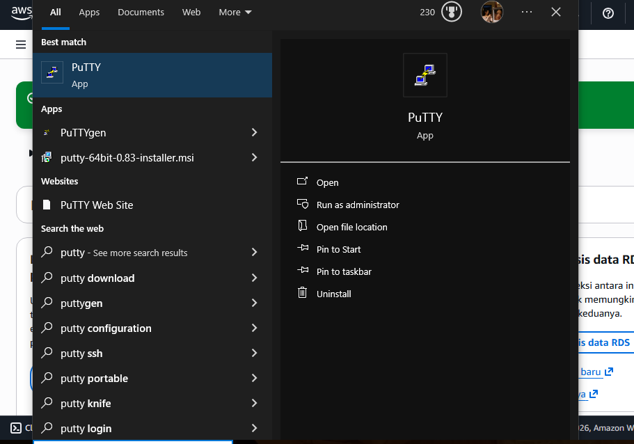
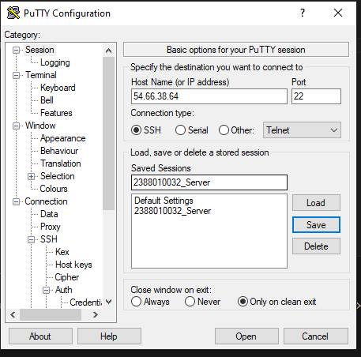
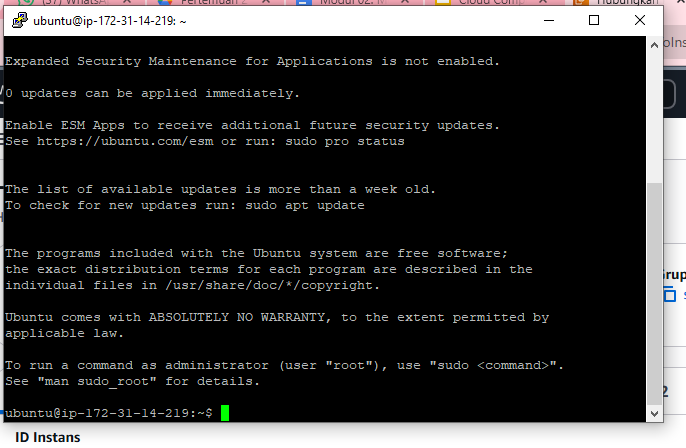
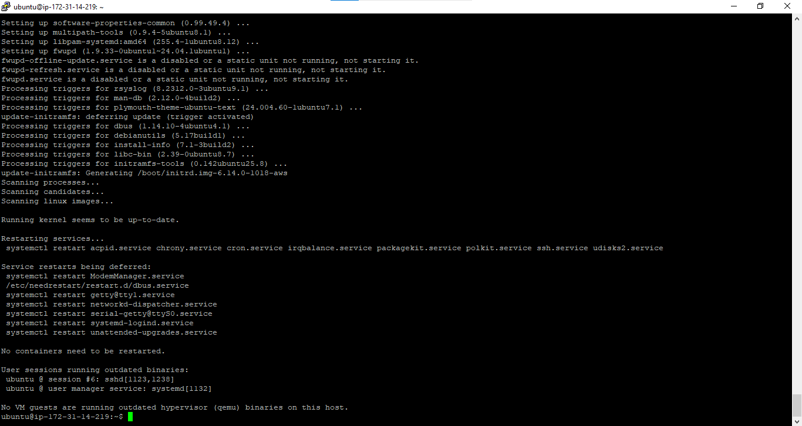
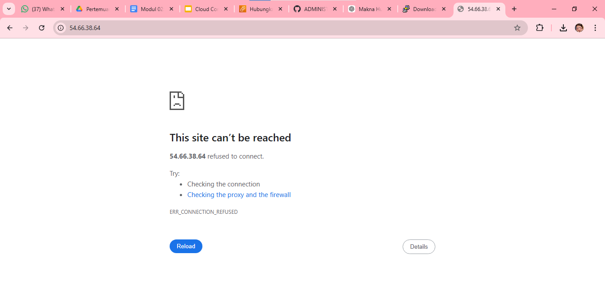
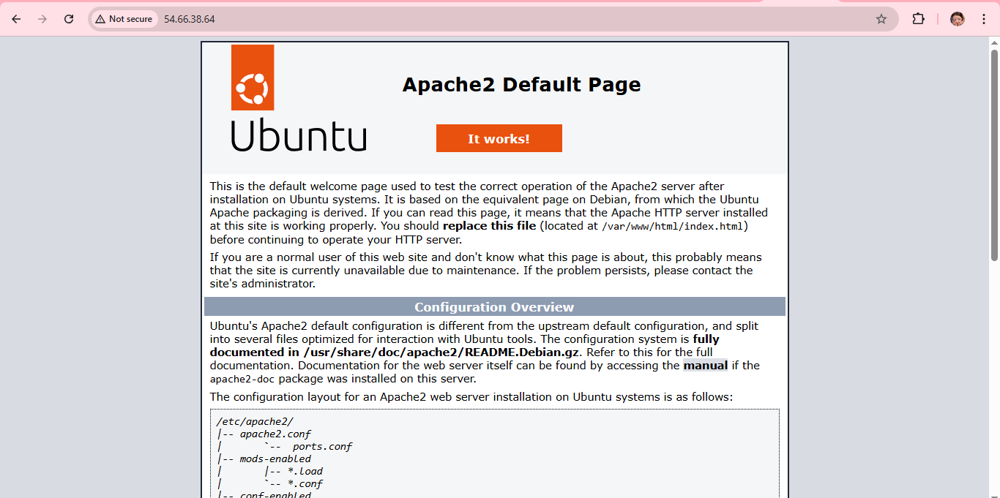
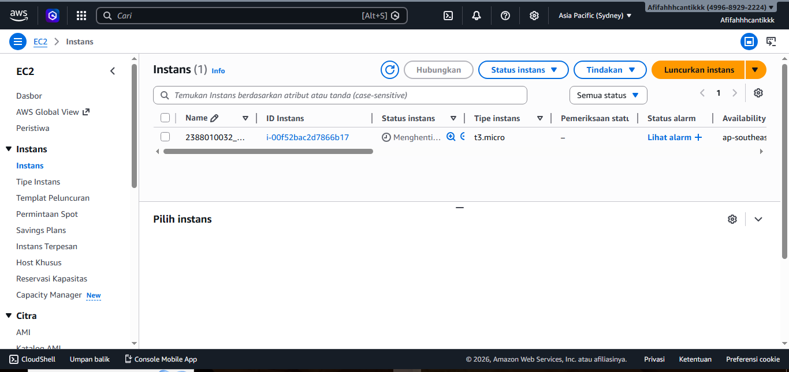

1. pastikan sudah install Putty

2. konversi file publik key dari  .pem menjadi .ppk di Putty
    buka puttyGen
    load File .pem
    save as .ppk

3. set up putty untuk remote SSH 
    • buka apps Putty
    • isi IP Public sesuai instance
    • isi nama session agar saaat connliect lagi    • tinggal load saja
    • load file .ppk(klik SSH -> Auth -> credentitals -> load file.ppk)
    • kembali ke session klik save
    • klik open 
    • masukan username sesuai instance 

4. "sudo apt-get update (update os) lanjut "sudo apt-get upgrade"

5. Pembuktian Remote SSH secara visual
    • Copy publik IPP Address instance paste ke browser

    • insall web server seperti Apache/Nginx
    • sudo apt insall apache2
    • reload browser

6. Matikan instance agar tidak kena tagihan 
    • sudi shutdown now
