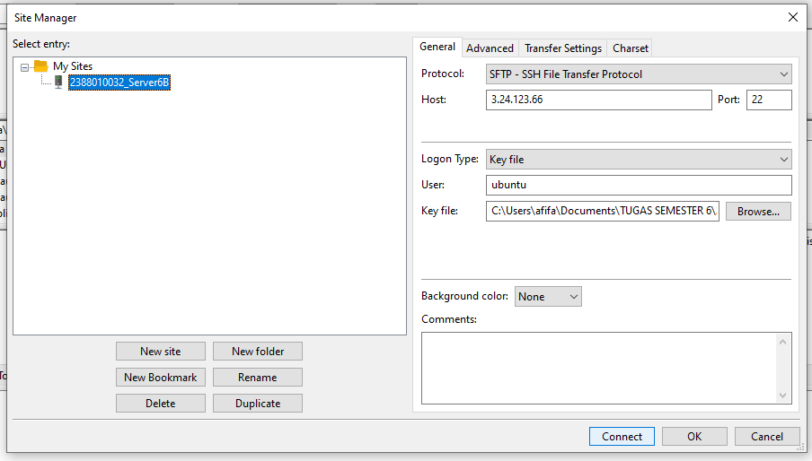
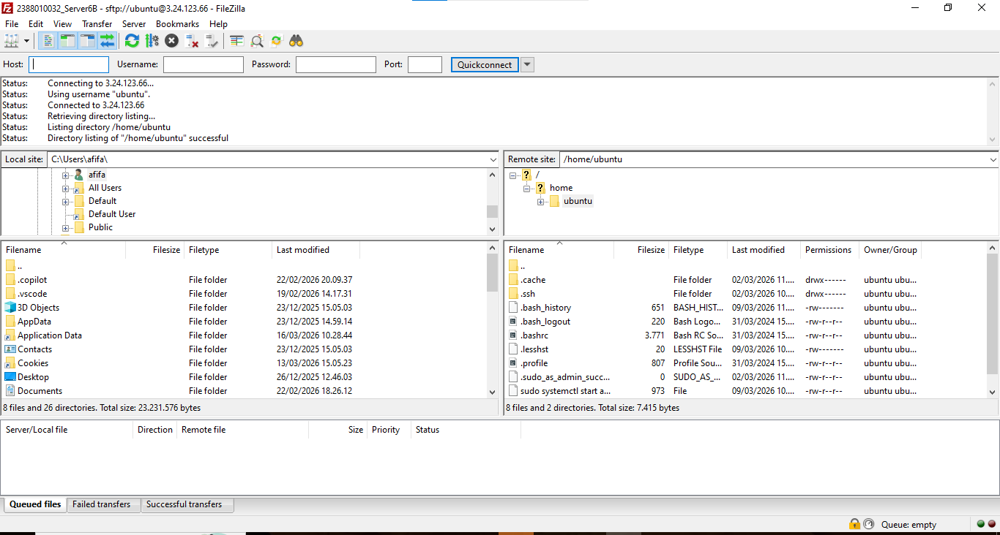
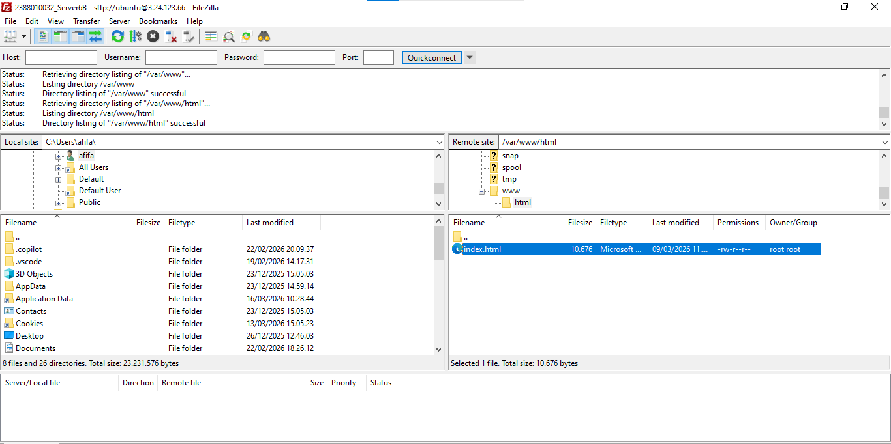
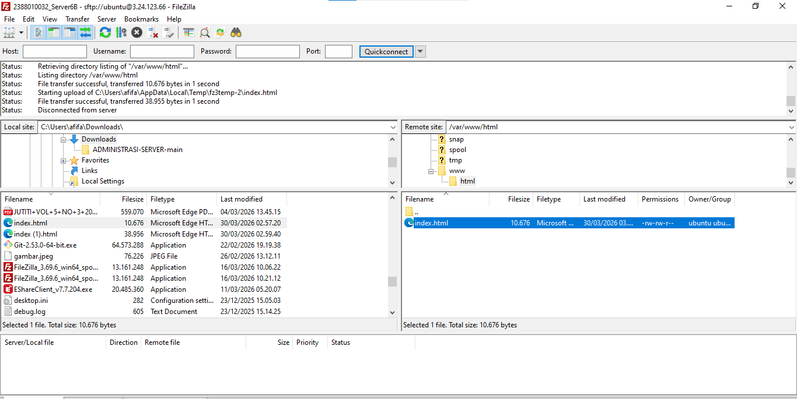
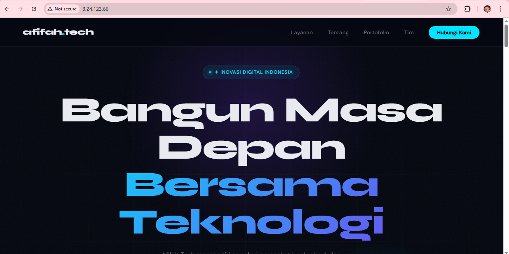

1. Memilih tools migrasi file, misal kita gunakan filezila 
    . unduh dan install filezila 
    . buka filezilla client
    . aktifkan instance di aws 
    . kembali ke filezilla client 
    . klik file > site manager 
    . klik new site
    . protocol > SFTP
    . host > IP public EC2
    . port > 22
    . logon type > key file
    . user > ubuntu
    . key file > pilih file .ppk/ .pem yang di download saat membuat instance
    . kilik ok CTRL + S klik Connect
     

2. Pada dashboard utama filezilla akan terbagi menjadi 2 panel
    - Panel Kiri > file lokal (komputer Anda)
    - Panel kanan > server file (AWS EC2)
    

3. Arahkan direktori cloud (panel kanan) ke folder area layanan server web
    - /var/www/html
    

4. Untuk solusi izin ditolak pada folder /var/www/html
     - Ubah kepemilikan folder
     - Mengubah folder /var/www/html agar dapat diakses oleh pengguna 'ubuntu'
     - Sintaks: sudo chown -R ubuntu:ubuntu /var/www/html
     

5. Edit file index.html menjadi profil perusahaan
    - Klik kanan pada file index.html
    - Klik edit
    - Edit file index.html menjadi profil perusahaan
    