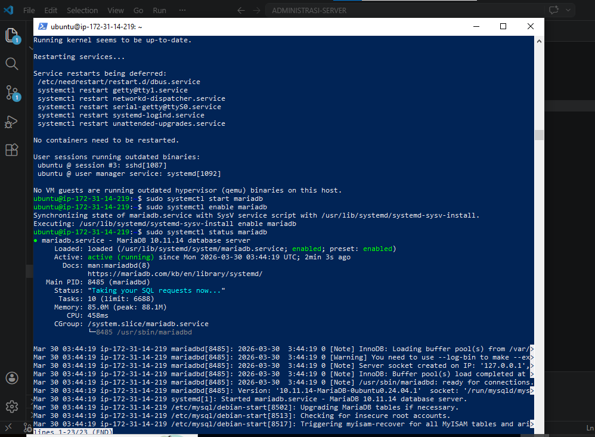
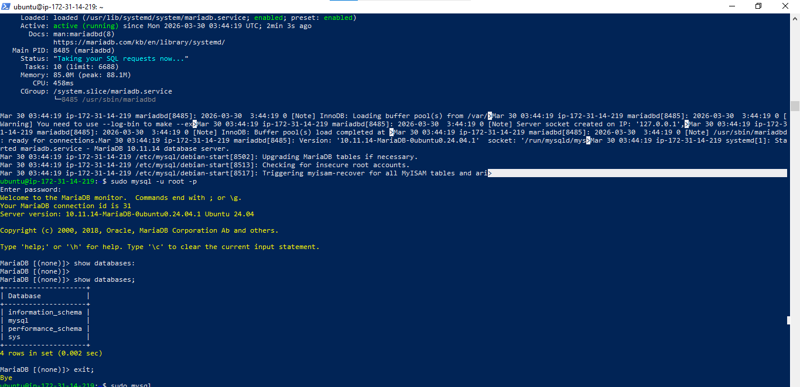
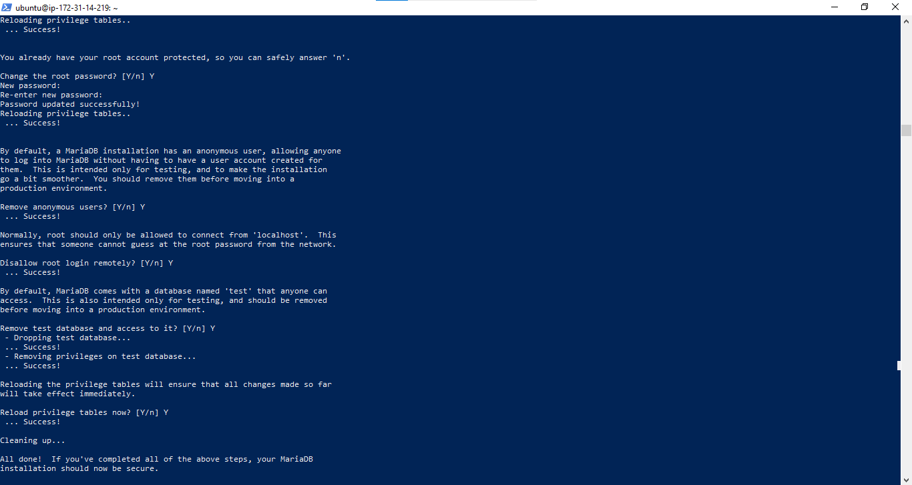
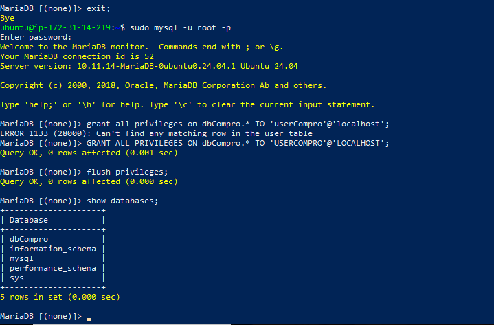
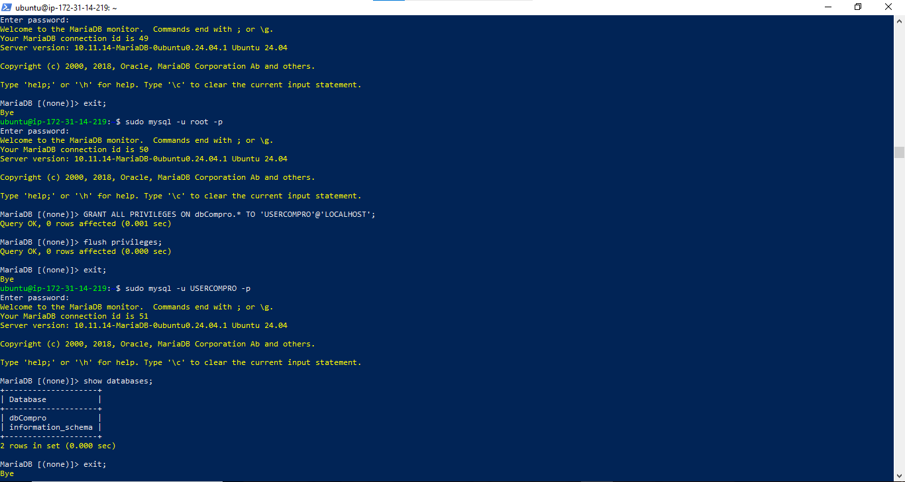

# Mmembuat Database MySQL di AWS EC2

1. Aktifkan Instance / VM di EC2
2. Remote SSH via Terminal
    - masukan ke folder penyimpanan private key AWS
    - masukan command (ssh -i namafile.pem ubuntu @[ip_address])
    - tekan enter
3. lakuka patching os
    - sudo apt-get update && sudo apt-get upgrade
4. kita akan install mariaDb
    - sudo apt-get install mariadb-server
    - sudo systemctl start mariadb
    - sudo systemctl enable mariadb
    - sudo systemctl status mariadb
    - coba apakah default setting yg berlaku ( sudo mysql -u root -p )
    - cek apakah masih ada data dummy (show databases;)

5. kita lakukan hardening security
    - masukkan comand ( sudo mysql_secure_installation)
    - masukkan password akun kuat untuk user
    - Remove anonymous users(Y)
    - disallow root login remotely (Y)
    - remove test database and acces to it(Y) reload privilage (Y)

6. membuat database dan user
    - membuat database untuk web company profile (Create database dbCompro;)
    - membuat user untuk web company profile (create user 'userCompro'@'localhost' identified by 'passwordCompro';)
    - memberikan hak akses user untuk web company profile (grant all privileges on dbCompro.* to 'usercompro'@'localhost';)()
    - flus pprivilage (flush privilage;)
    - keluar exit

7. login sebagai user baru
    - masuukan command (mysql -u userCompro -p)
    - masukkan password (passwordCompro)
    - cek apakah database db compro ada(show databases;)

