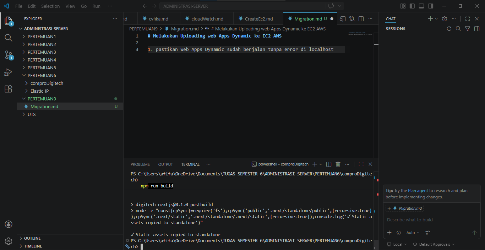
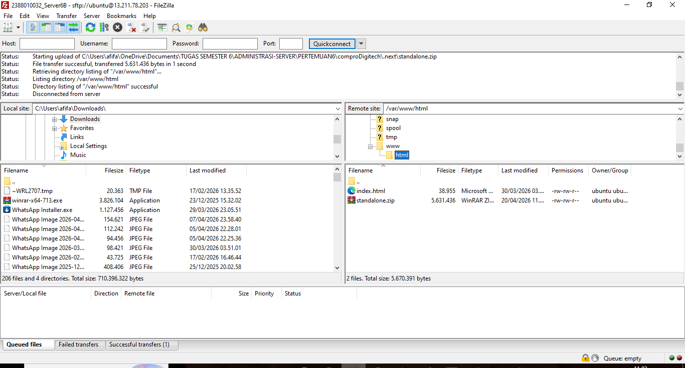
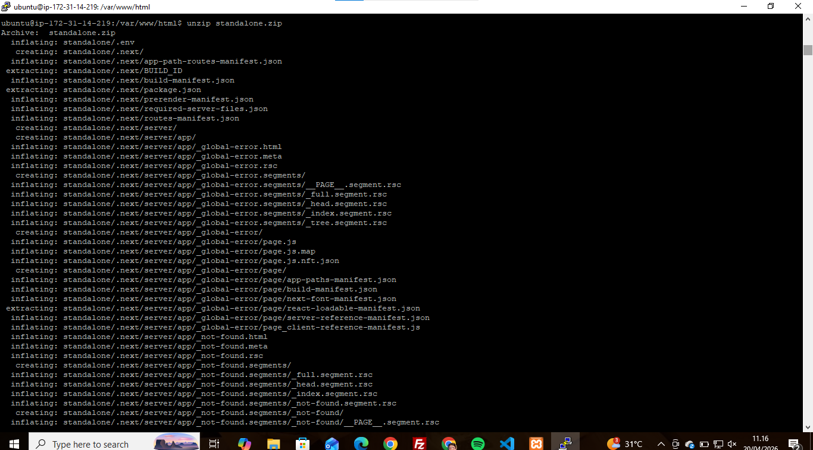
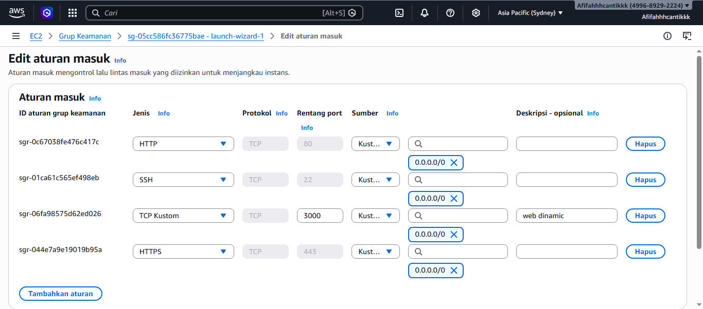
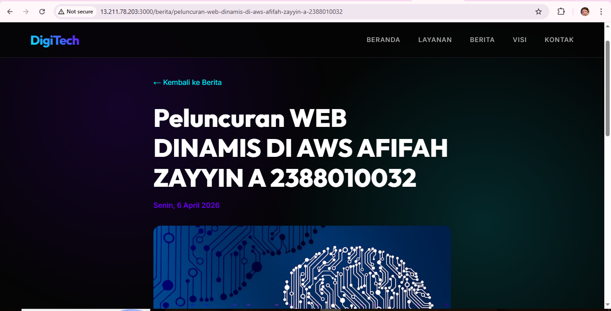

# Melakukan Uploading web Apps Dynamic ke EC2 AWS

1. pastikan Web Apps Dynamic sudah berjalan tanpa error di localhost
2. jika sudah tanpa error kita akan membuat folder build
    - npm run build 
    - pastikan menghasilkan folder 
    

3. proses uplad file folder standlone
    - lakukan proses archine archive pada folder .next/standalone dan folder public.zip
    - instance yang sedang berjalan -> sambungkan ke ssh -> buka FileZilla
    - upload file hasil archive .zip standalone ke ec2 AWS menggunakan Filezilla
    - ekstrak file hasil arsip di ec2 aws
    

    instal alat unzip di ec2 aws
    - sudo apt install unzip -y
    ekstrak file hasil arsip di ec2 aws
    - unzip standalone.zip

    

4. ekspor dbCompro dari localhost impor ke ec2 AWS
    - login ke SQL ec2 sudo mysql -u USERCOMPRO -p
    - gunakan dbCompro;
    - copy paste query SQL dari export dbCompro di Localhost
    - cek setiap tabel aoakah sudah terisi
        - pilih * dari berita;
        - pilih semua dari pengguna;

5. sesuaikan isi dile .env di ec2 aws
    - DB_HOST=localhost
    - DB_USER=USERCOMPRO
    - DB_PASSWORD=PASSWORD
    - DB_NAME=dbCompro
    - ctrl s

6. di terminal ssh cd ke folder standalone run apps 
    - pm2 start server.js 
    - pm2 save 
    - pm2 startup

7. Buka port 3000 di grup keamanan ec2 aws
    - edit grup keamanan
    - tambahkan aturan
    - menyimpan

    

8. SIMPAN PERUBAHAN
    