(UAS Server Administration)

WEB STATIS 

 1. Persiapan Infrastruktur (AWS EC2 & Docker)
    - Pembuatan instance EC2 
    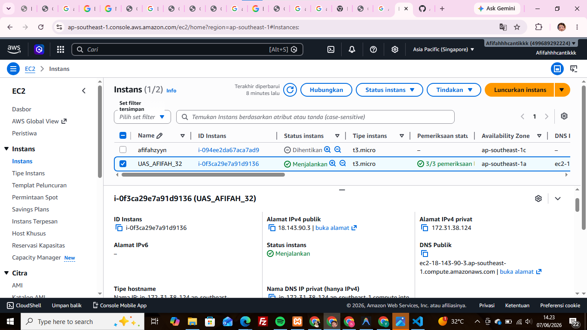

    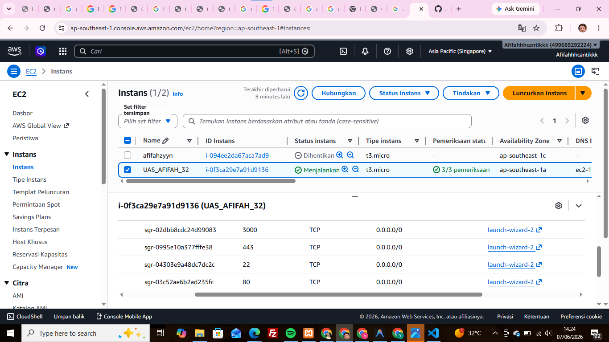

2. Buat Repo Github
    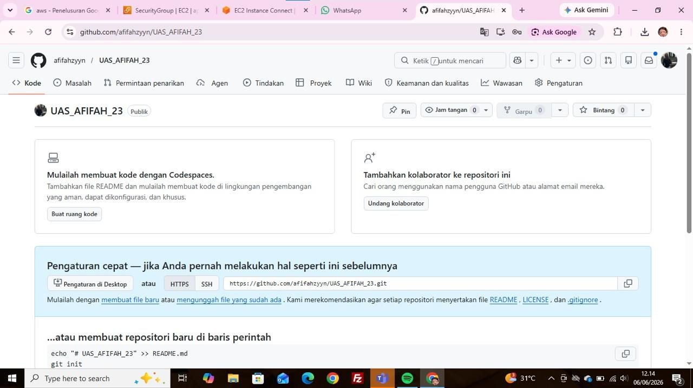

3. Install docker di terminal dan cek systemctl running
    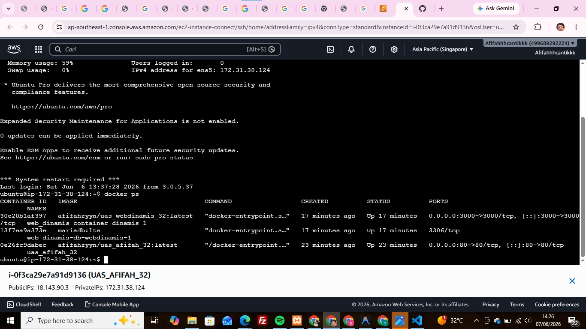

4. Buat Repo baru di Docker
    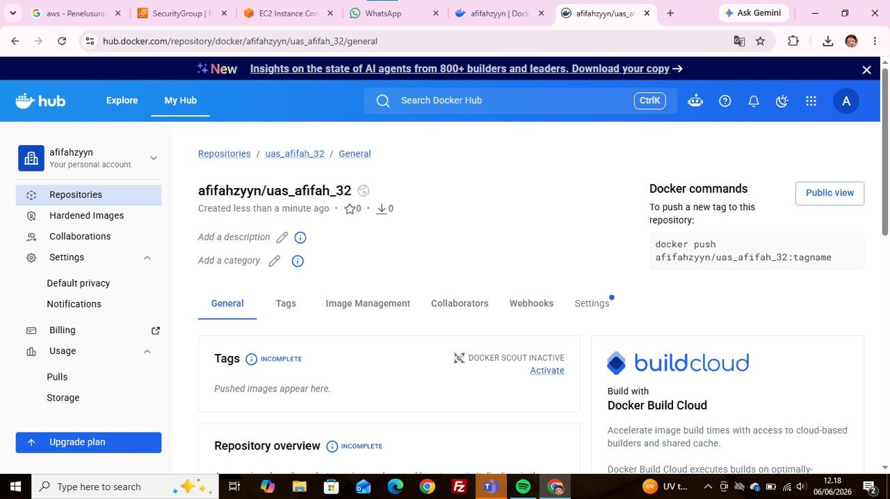

5. Buat Token di Docker
    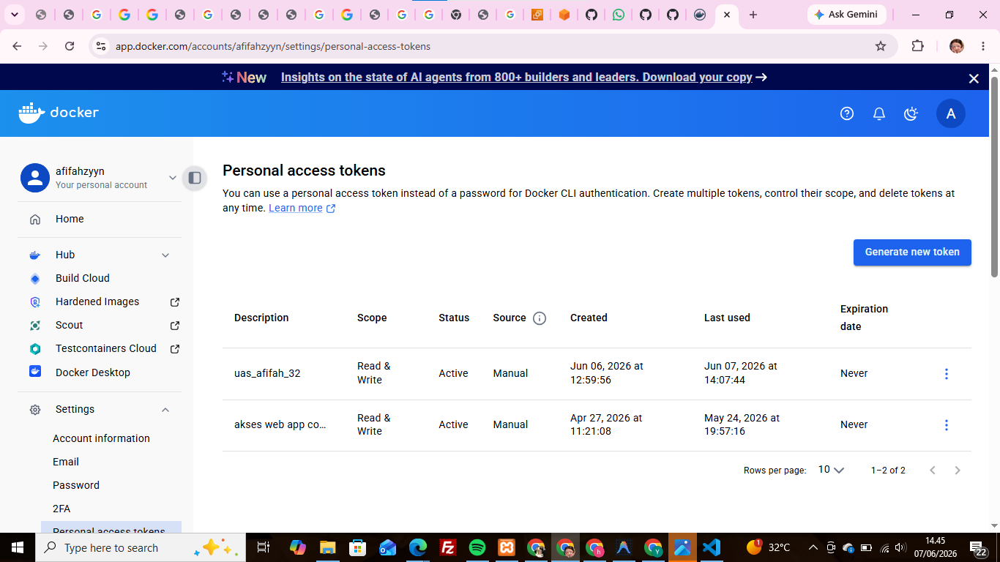

6. Buat secret_key di Github
    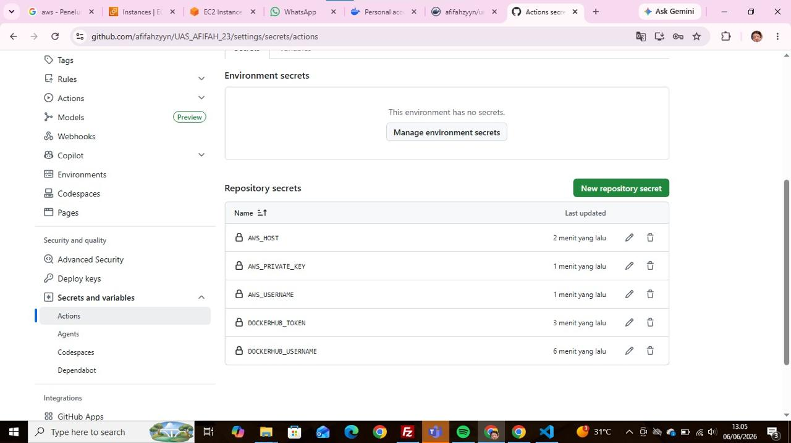

7. Deploy web statis
    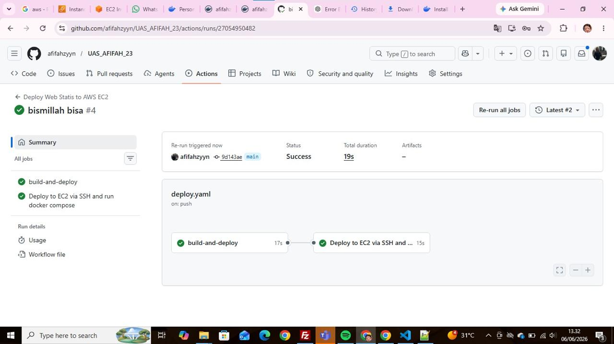

8. Tampil Web CV Statis
    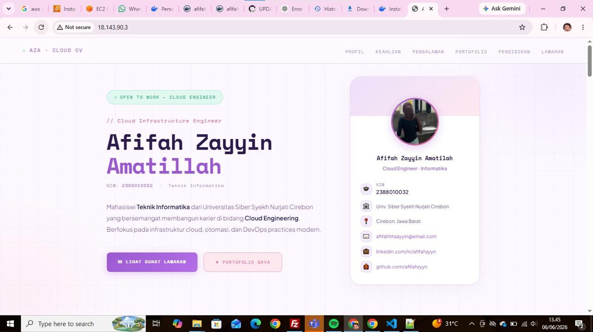

9. deeploy web statis yang diganti
    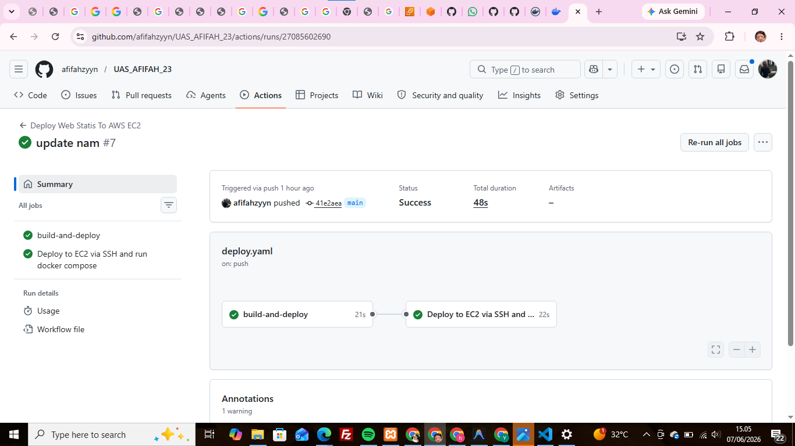

10. cv yang nama di ubah
    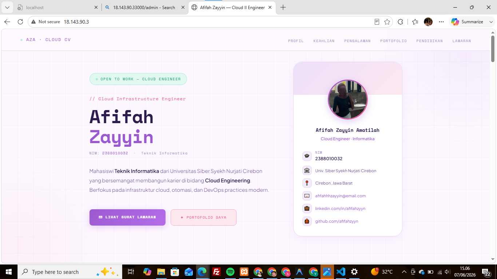

WEB-DINAMIS
1. 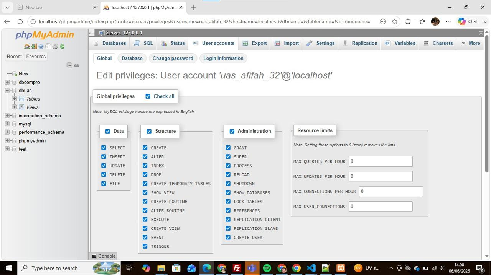
2. Buat repo docker untuk web dinamis
    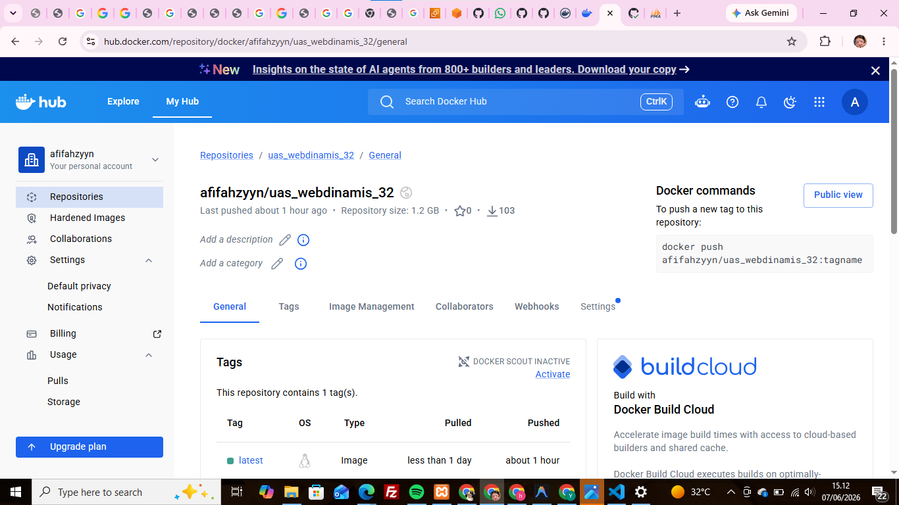

3. buat Website dinamis cafe
    - Buat Dockerfile yg menyesuaikan dengan bahasa dipakai (next.js)
    - Buat juga file docker-compose.yml di dalam folder web-dinamis
    - Buat deploy-web-dinamis.yml
4. Deploy Web-Dinamis
    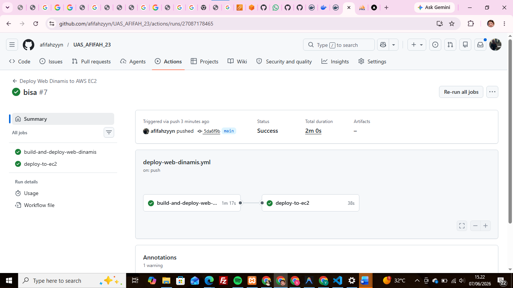

    - tampilan dasboard kopi nusantara
    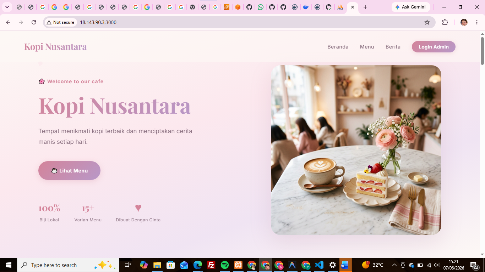

    - tampilan login 
    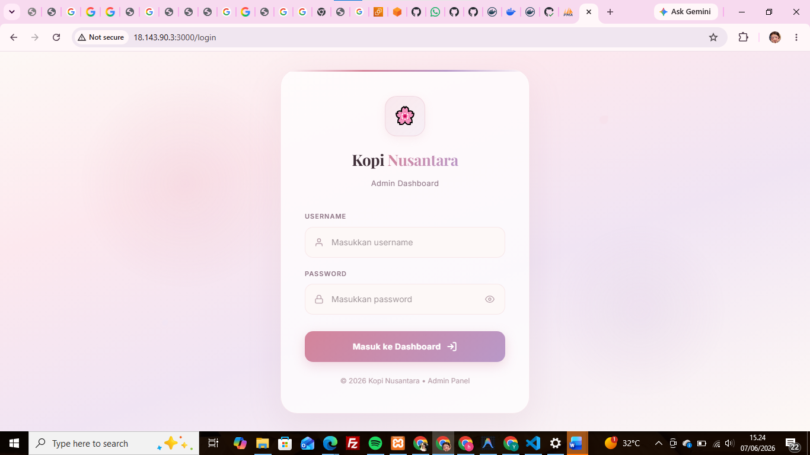
        USERNAME : admin
        PASSWORD : password

    - tampilan dasboard admin 
    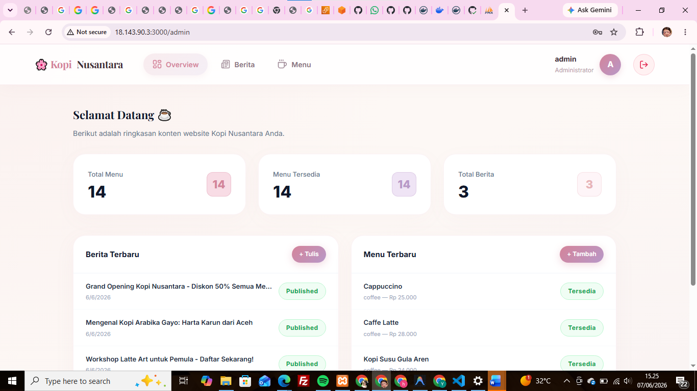