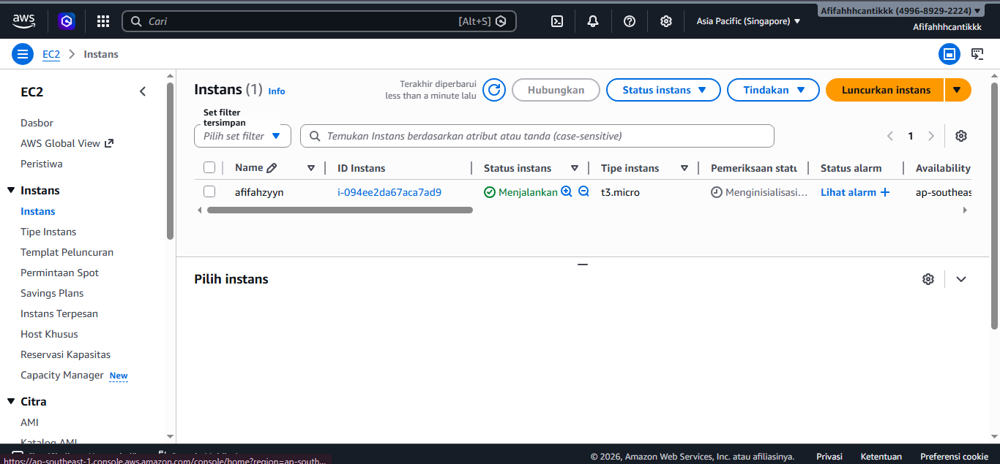
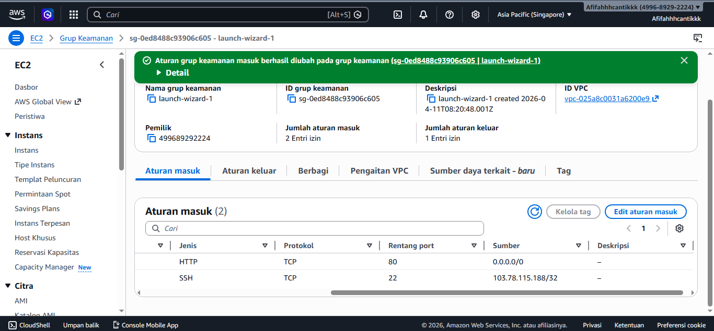
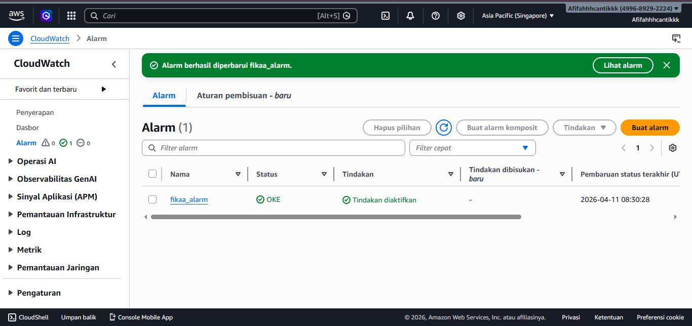
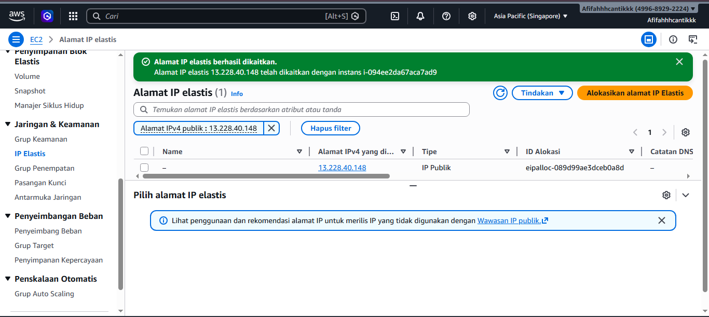
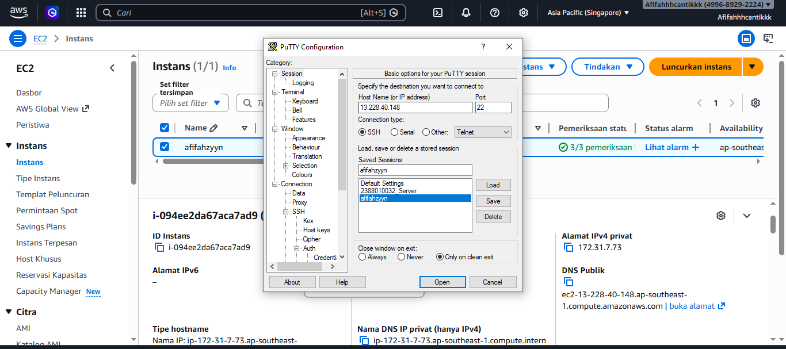
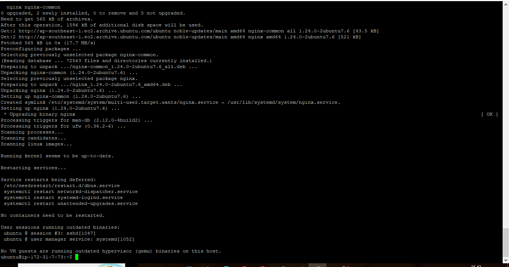
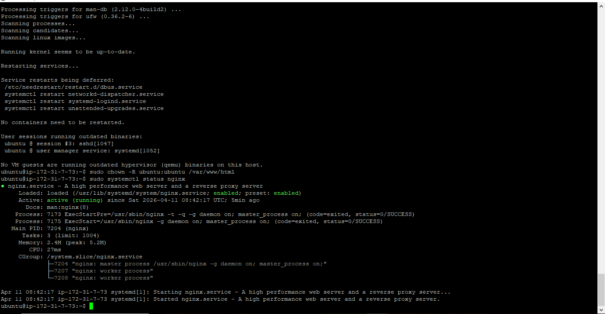
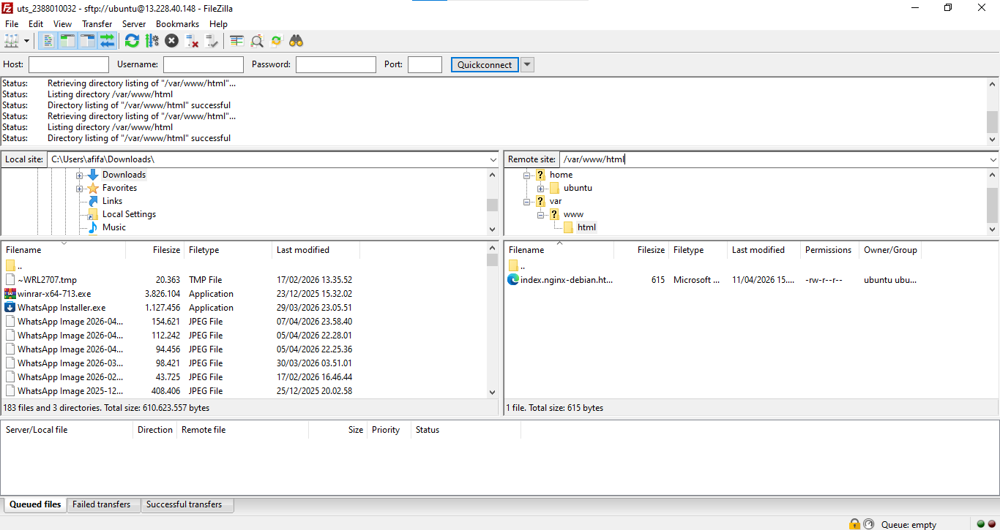
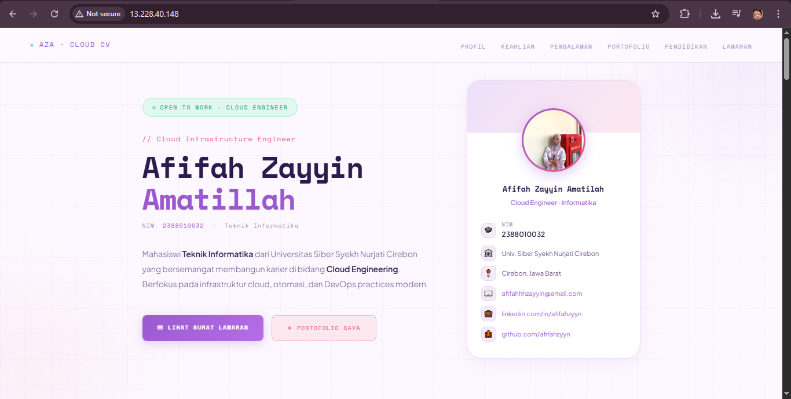

UJIAN TENGAH SEMESTER (Deploy Curriculum Vitae (CV) atau Portofolio Dalam bentuk Website)

1. Buat instance EC2 (singapura)

2. HTTP (80) SSH (22)

3. CloudWatch Alarms

4. elastic IP

5. putty

6. install nginx

7. satus nginx d puty

8. filezila

9. web cv lamaran 

